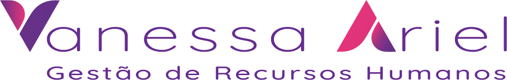

<p align="center">
  
</p>

<h1 align="center">Vanessa Ariel · Gestão de RH</h1>

<p align="center">
  Landing page de alta performance para consultoria de RH — página única, estática e sem JavaScript no HTML.
</p>

<p align="center">
  
  
  
  
  
  
  
  
  
</p>

---

## Sumário

- [Visão geral](#visão-geral)
- [Layout](#layout)
- [Design system](#design-system)
- [Fontes](#fontes)
- [Tecnologias usadas](#tecnologias-usadas)
- [Estrutura do projeto](#estrutura-do-projeto)
- [Scripts](#scripts)
- [Segurança & performance](#segurança--performance)
- [Referência legada](#referência-legada)

---

## Visão geral

Página única para a consultora **Vanessa Ariel**, com foco em conversão: motion 3D cinematográfico, contadores animados, oferta informativa e contato direto via WhatsApp. **Zero JavaScript por padrão** (Astro islands) e animações otimizadas para `prefers-reduced-motion`.

## Layout

Ordem das seções na página (`src/pages/index.astro`):

1. **Hero** — banner em imagem full-width, inteiro clicável → `#contato`; `aspect-[3/2]` no mobile e `min-h-[90svh]` no desktop
2. **Stats** — contadores animados (`use-count-up`) em grid 2/4 com números em gradiente
3. **Investment** — bloco informativo "Invista na qualidade do seu RH" com badge, benefícios e CTA WhatsApp
4. **About** — foto + descrição, valores (Acolhimento/Estratégia) e citação em destaque
5. **Pillars** — "Nossos Pilares de Atuação" como imagem de fundo
6. **Services** — bento grid de 3 cards com tilt 3D e shake nos ícones
7. **Workshop** — foto + texto do workshop
8. **Testimonials** — depoimentos
9. **Faq** — acordeão animado (`AnimatePresence`)
10. **Contact** — formulário que compõe mensagem → WhatsApp + canais de contato

Complementos: **Header** (sticky com blur + menu mobile hambúrguer), **Footer** (marca d'água do logo), **LGPDBanner** (consentimento em `localStorage`) e **WhatsAppFloat**.

### Responsividade

- Mobile-first com breakpoints `sm`/`md`/`lg`/`xl`
- Drawer mobile com `AnimatePresence`, stagger e bloqueio de scroll
- Nenhum texto/CTA estoura o card em telas estreitas (tokens de tipografia ajustados por breakpoint)

## Design system

Design system **"Aura Professional"** centralizado em `src/styles/global.css` via `@theme` do Tailwind v4:

| Categoria       | Tokens                                                                                         |
| --------------- | ---------------------------------------------------------------------------------------------- |
| **Cores**       | primária, gradiente da marca (`brand-gradient`), superfícies, `hero-gradient`                  |
| **Tipografia**  | `display`/`headline`/`body`/`label` (ex.: `text-headline-lg`, `text-body-md`, `text-label-sm`) |
| **Espaçamento** | `gap-xs` … `gap-2xl`, margens `margin-mobile`/`margin-desktop`                                 |
| **Raio**        | `radius-sm` … `radius-2xl`                                                                     |

Utilitários extras: `glass-card-dark`, `brand-text-gradient-light`, `floating`, keyframes `shake`/`float`.

## Fontes

- **Arimo** (Google Fonts) self-hosted via `@fontsource/arimo` — sem CDN externo
- Pesos carregados conforme o design (regular/semibold/bold) com `font-display: swap`
- Escala tipográfica definida por tokens no `@theme` (display/headline/body/label) com line-height e weight por nível

## Tecnologias usadas

| Tecnologia                 | Função                                                        |
| -------------------------- | ------------------------------------------------------------- |
| **Astro 7**                | Framework estático (SSG), renderização server-first com ilhas |
| **React 19**               | Ilhas interativas (`@astrojs/react`)                          |
| **TypeScript**             | Tipagem estrita em todo o projeto                             |
| **Tailwind CSS v4**        | Design system via `@theme` + plugin `@tailwindcss/vite`       |
| **motion** (framer-motion) | Entradas 3D (`MotionIn`), parallax, drawers, micro-interações |
| **Lenis**                  | Scroll suave + navegação por âncoras                          |
| **lucide-react**           | Ícones de UI (cards, CTAs)                                    |
| **@phosphor-icons/react**  | Ícones oficiais de marcas (LinkedIn, Instagram, WhatsApp)     |
| **@fontsource/arimo**      | Fonte self-hosted                                             |
| **Vite**                   | Build tooling do Astro                                        |
| **Vitest**                 | Testes unitários                                              |
| **Prettier**               | Formatação/lint                                               |

## Estrutura do projeto

```
vanessa-ariel-grh/
├── public/
│   ├── logo-horizontal.webp    # logo oficial (WebP lossless)
│   ├── logo-icon.webp          # símbolo (favicon + apple-touch-icon)
│   ├── logo-texto.webp         # marca d'água do Footer
│   └── ...
├── src/
│   ├── pages/
│   │   └── index.astro         # página única (seções na ordem do layout)
│   ├── components/
│   │   ├── sections/           # Hero, Stats, Investment, About, Pillars, Services,
│   │   │                       #   Workshop, Testimonials, Faq, Contact, Footer,
│   │   │                       #   Header, MobileNav, LGPDBanner, WhatsAppFloat
│   │   └── ui/                 # MotionIn, Card3D, ParallaxLayer, ScrollReveal, ...
│   ├── hooks/
│   │   ├── use-count-up.ts     # contador animado (IntersectionObserver + RAF)
│   │   ├── use-safe-motion.ts  # wrapper a11y de reduced-motion
│   │   └── use-scroll-spy.ts   # seção ativa no scroll
│   ├── lib/
│   │   ├── motion-tokens.ts    # tokens/springs/gates de motion
│   │   └── sections.ts         # NAV_SECTIONS (desktop) e MENU_SECTIONS (mobile)
│   ├── assets/                 # fotos otimizadas (WebP) via astro:assets
│   ├── styles/
│   │   └── global.css          # design system "Aura Professional" + utilitários
│   └── test/                   # testes Vitest
├── index.html                  # página original de referência (legado)
├── CLAUDE.md                   # estado atual do projeto (stack/arquitetura)
└── TODO.md                     # changelog + pendências
```

## Scripts

```bash
npm run dev        # servidor de desenvolvimento
npm run build      # build estático em dist/
npm run preview    # pré-visualização do build
npm run lint       # Prettier (check)
npm run format     # Prettier (write)
npm run test       # Vitest
npm run test:watch # Vitest em modo watch
```

## Segurança & performance

- Sem chaves/secrets no client; sem backend nesta fase
- Animações apenas em `transform`/`opacity`; respeita `prefers-reduced-motion` + gate de devices low-end
- Imagens em **WebP** otimizadas; fonte e ícones self-hosted (sem CDN externo)
- Guard de montagem SSR-safe (initial = output do servidor) evita hydration mismatch
- Logos em WebP lossless no `public/` (PNGs de ~6MB removidos do histórico)

## Referência legada

`index.html` (renomeado de `site-code.html`) é a página original de referência do visual.
